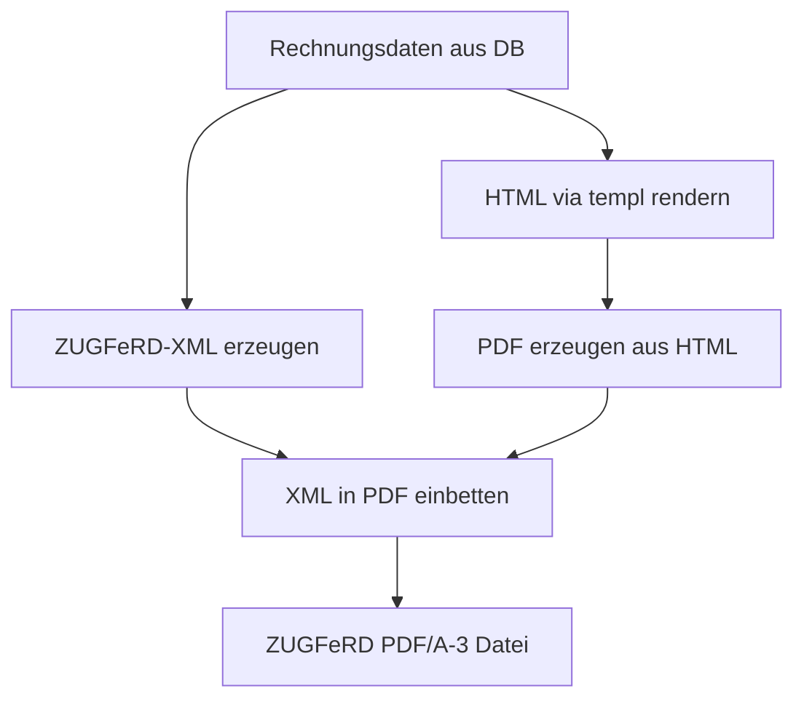

# Konzept: Rechnungsdesign & PDF-Erzeugung

Dieses Dokument beschreibt das Konzept zur Erstellung von gedruckten/digitalen Rechnungen. Es orientiert sich visuell an der bereitgestellten Vorlage [Beispielrechnung.pdf](file:////wsl.localhost/Ubuntu-24.04/home/geipman/projects/faktura/docs/migration/Beispielrechnung.pdf) und beschreibt, wie das Layout strukturell definiert, per CSS angepasst und als ZUGFeRD-konformes PDF/A-3 generiert wird.

---

## 1. Analyse der Vorlage (Beispielrechnung.pdf)

Die Beispielrechnung weist eine klassische, tabellarische Struktur auf, die für den Kompostwerk-Betrieb optimiert ist:

1. **Briefkopf & Anschriftenfeld**:
   * Oben links: Anschrift des Rechnungsempfängers (Kunde).
   * Oben rechts: Rechnungsmetadaten (Ausstellungsdatum, Rechnungsnummer).
2. **Titel & Einleitungstext**:
   * Zentrierter, gesperrter Titel `R E C H N U N G`.
   * Standardisierter Einleitungstext mit Verweis auf die beigefügten Wiegebelege.
3. **Leistungszeitraum**:
   * Explizite Nennung des Abrechnungsmonats (z. B. `Rechnungszeitraum: Januar 2026`).
4. **Positionstabelle (Aggregiert)**:
   * Spalten: `Material`, `Menge` (inkl. Einheit "t"), `Preis pro Einh.`, `USt-Satz`, `Netto`.
   * Zeilen: Zusammenfassung gleicher Materialien (z. B. mehrere Wiegungen von "Grünabfall" zu einer Summe addiert).
5. **Mehrwertsteuer-Matrix (Steueraufteilung)**:
   * Pflichtbestandteil für ZUGFeRD: Separate Auflistung der Netto-, USt-Prozent-, USt-Betrag- und Bruttosummen, aufgeteilt nach Steuersätzen (7 % und 19 %).
6. **Zahlungsbedingungen & Bankdaten (Fußzeile)**:
   * Angabe des Zahlungsziels (z. B. "Zahlbar innerhalb 14 Tagen ohne Abzüge").
   * Angabe der Bankverbindungsdaten (IBAN, BIC).

---

## 2. Technische Umsetzung: HTML-Templates & CSS

Um das Design wartbar und anpassbar zu machen, trennen wir die **HTML-Struktur** vom **visuellen Styling (CSS)**.

### 2.1 Struktur über Go `templ`
Das Grundgerüst der Rechnung wird als Go-Typ-sicheres HTML-Template in `internal/templates/invoice.templ` definiert.

```go
package templates

// Pseudocode für das Rechnungs-Template
templ InvoicePDF(metadata InvoiceHeader, positions []InvoiceLine, taxMatrix []TaxRow, company CompanyData) {
    <div class="invoice-container">
        <!-- Briefkopf -->
        <div class="header-section">
            <div class="recipient-address"> ... </div>
            <div class="invoice-meta"> ... </div>
        </div>

        <h2>RECHNUNG</h2>
        <p class="intro-text"> ... </p>

        <!-- Positionen -->
        <table class="positions-table">
            <thead> ... </thead>
            <tbody> ... </tbody>
        </table>

        <!-- Steuermatrix -->
        <table class="tax-matrix"> ... </table>

        <!-- Fusszeile -->
        <div class="footer-section"> ... </div>
    </div>
}
```

### 2.2 Styling & Anpassbarkeit via CSS
Das Aussehen (Schriftarten, Farben, Ränder, Linienstärken) wird über eine separate CSS-Datei (z. B. `assets/css/invoice.css`) gesteuert.

* **Feste Struktur**: HTML-Tags, Tabellenspalten und die Anordnung der Boxen sind fest vorgegeben, um sicherzustellen, dass die Rechnung immer auf eine oder definierte A4-Seiten passt.
* **Flexibles Aussehen**: Über das CSS können Administratoren oder Entwickler:
  * Die **Schriftart** ändern (z. B. Umstellung von Arial auf Inter oder Outfit).
  * **Farben** anpassen (z. B. Akzentfarben für Tabellenköpfe oder Linien).
  * Das **Firmenlogo** einbinden oder ausblenden.
  * **Abstände (Paddings/Margins)** feinjustieren.

### 2.3 Druckoptimierung (CSS Paged Media)
Um sicherzustellen, dass die PDF-Ausgabe exakt den DIN-A4-Vorgaben entspricht, nutzen wir standardisierte CSS-Druckanweisungen (`@media print`):

```css
@media print {
    @page {
        size: A4;
        margin: 20mm 15mm 20mm 15mm; /* Normgerechte Ränder */
    }
    body {
        background: white;
        color: black;
    }
    .invoice-container {
        width: 100%;
        page-break-after: avoid;
    }
    tr {
        page-break-inside: avoid; /* Verhindert hässliche Zeilenumbrüche */
    }
}
```

---

## 3. Workflow zur PDF/A-3 ZUGFeRD-Erstellung

ZUGFeRD verlangt, dass die Rechnung als **PDF/A-3** vorliegt und das XML-Dokument `factur-x.xml` (bzw. `zugferd-invoice.xml`) als Anhang in der PDF-Datei eingebettet ist. 

Der serverseitige Erstellungsprozess läuft in drei Schritten ab:



### Schritt 1: XML-Generierung
Die Rechnungsdaten werden in das standardisierte ZUGFeRD-XML-Format (EN 16931) konvertiert.

### Schritt 2: PDF-Erzeugung aus HTML
Das Go-Backend rendert die HTML-Rechnung. Zur Umwandlung von HTML in PDF gibt es zwei etablierte Ansätze im Go-Umfeld:
* **Option A (Serverseitig über Chrome headless)**: Das Go-Backend startet im Hintergrund eine Chromium-Instanz (z. B. via Playwright/Go oder Go-Chrome-DP) und druckt die HTML-Seite als PDF. Dies garantiert eine 100% exakte CSS-Rendering-Qualität.
* **Option B (Reiner Go-PDF-Generator)**: Verwendung einer Go-Bibliothek wie `github.com/johnfercher/maroto` oder `github.com/signintech/gopdf`. Hier wird das Layout direkt im Go-Code aufgebaut (nicht über HTML). Dies ist performanter, schränkt das Styling via CSS aber stark ein.

*Empfehlung*: Da das Styling über CSS anpassbar sein soll, ist **Option A (HTML-to-PDF)** die flexiblere Wahl.

### Schritt 3: XML-Einbettung (Attachment)
Nachdem das PDF generiert wurde, muss das `factur-x.xml` als Dateianhang (Embedded File) in das PDF integriert werden.
* In Go nutzen wir dafür eine PDF-Bibliothek (z. B. `github.com/pdfcpu/pdfcpu` oder `github.com/signintech/gopdf`), die das XML-Dokument als Attachment mit der Beziehungsart `Alternative` (in Übereinstimmung mit dem PDF/A-3-Standard) in die PDF-Struktur schreibt.
