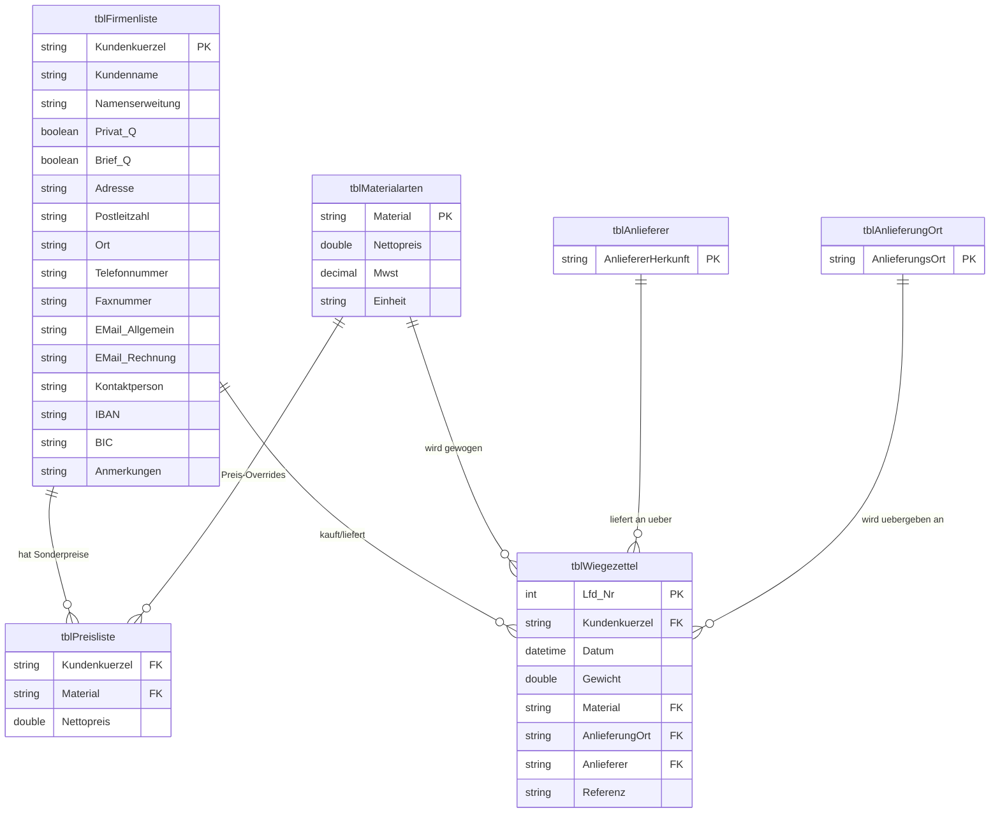

# Legacy-Access-DB Schemaanalyse

Dieses Dokument bietet eine detaillierte Analyse der XML-Schema-Definitionsdateien (XSD), die aus der alten MS-Access-Datenbank exportiert wurden. Es beschreibt die Altdatenstrukturen, Beziehungen, Feldbedingungen, Auswirkungen auf die Geschäftslogik und Empfehlungen für das neue Go + SQLite-System.

---

## 1. Entitäten-Übersicht & Schema-Mapping

Das Altsystem besteht aus 6 Tabellen. Nachfolgend sind deren Strukturen, Datentypen und Primärbedingungen dargestellt.

### 1.1 Kundenverzeichnis (`tblFirmenliste`)
Diese Tabelle enthält die Stammdaten für Kunden (sowohl gewerbliche Firmen als auch Privatpersonen).

* **Quelldatei**: [tblFirmenliste.xsd](file:////wsl.localhost/Ubuntu-24.04/home/geipman/projects/faktura/docs/migration/schema/tblFirmenliste.xsd)
* **Primärschlüssel**: `Kundenkürzel` (nvarchar 50, erforderlich, nicht nullbar)
* **Felder**:

| Feldname | Typ | Nullbar | Standard | Beschreibung |
| :--- | :--- | :--- | :--- | :--- |
| `Kundenkürzel` | `nvarchar(50)` | Nein | - | Primärschlüssel. Ein eindeutiges Textkürzel (z. B. "HAUG"). |
| `Kundenname` | `nvarchar(50)` | Nein | - | Hauptname des Kunden/der Firma. |
| `Namenserweitung` | `nvarchar(50)` | Ja | - | Zweite Namenszeile. |
| `Privat_x0020__x003F_` | `bit (bool)` | Nein | `False` | True = Privatperson, False = Gewerblicher Kunde. |
| `Brief_x003F_` | `bit (bool)` | Nein | `False` | True = Rechnung per Post versenden. |
| `Adresse` | `nvarchar(100)` | Ja | - | Straße und Hausnummer. |
| `Postleitzahl` | `nvarchar(10)` | Ja | - | Postleitzahl (konfiguriert mit der Maske `00000`). |
| `Ort` | `nvarchar(50)` | Ja | - | Name des Ortes. |
| `Telefonnummer` | `nvarchar(30)` | Ja | - | Telefonnummer. |
| `Faxnummer` | `nvarchar(30)` | Ja | - | Faxnummer. |
| `E-Mail_Allgemein` | `nvarchar(50)` | Ja | - | Allgemeine E-Mail-Adresse. |
| `E-Mail_Rechnung` | `nvarchar(255)` | Ja | - | E-Mail-Adresse für elektronische Rechnungen (wichtig für ZUGFeRD). |
| `Kontaktperson` | `nvarchar(50)` | Ja | - | Name des Hauptansprechpartners. |
| `IBAN` | `nvarchar(50)` | Ja | - | IBAN des Kunden. |
| `BIC` | `nvarchar(50)` | Ja | - | BIC des Kunden. |
| `Anmerkungen` | `ntext (memo)` | Ja | - | Beliebige Bemerkungen oder Notizen. |

---

### 1.2 Material-/Produktarten (`tblMaterialarten`)
Diese Tabelle enthält den Produktkatalog der Materialien, die vom Kompostwerk verkauft oder angenommen werden.

* **Quelldatei**: [tblMaterialarten.xsd](file:////wsl.localhost/Ubuntu-24.04/home/geipman/projects/faktura/docs/migration/schema/tblMaterialarten.xsd)
* **Primärschlüssel**: `Material` (nvarchar 100, erforderlich, nicht nullbar)
* **Felder**:

| Feldname | Typ | Nullbar | Standard | Beschreibung |
| :--- | :--- | :--- | :--- | :--- |
| `Material` | `nvarchar(100)` | Nein | - | Primärschlüssel. Materialbezeichnung (z. B. "Rindenmulch"). |
| `Nettopreis` | `money` | Ja | - | Standard-Netto-Verkaufspreis (wird verwendet, wenn kein Sonderpreis existiert). |
| `Mwst` | `decimal(4,2)` | Ja | `0.00` | Umsatzsteuersatz (Prozentsatz, z. B. 0.19 oder 19.00). |
| `Einheit` | `nvarchar(255)` | Ja | - | Abrechnungseinheit (z. B. "t" für Tonnen, "m³" für Kubikmeter). |

---

### 1.3 Kunden-Preisliste (`tblPreisliste`)
Diese Verknüpfungstabelle definiert kundenspezifische Sonderpreise für bestimmte Kunden- und Materialkombinationen. Sie überschreibt den Standardpreis aus `tblMaterialarten`.

* **Quelldatei**: [tblPreisliste.xsd](file:////wsl.localhost/Ubuntu-24.04/home/geipman/projects/faktura/docs/migration/schema/tblPreisliste.xsd)
* **Primärschlüssel**: `Kundenkürzel` + `Material` (zusammengesetzter Schlüssel)
* **Felder**:

| Feldname | Typ | Nullbar | Standard | Beschreibung |
| :--- | :--- | :--- | :--- | :--- |
| `Kundenkürzel` | `nvarchar(50)` | Ja | - | Fremdschlüssel -> `tblFirmenliste.Kundenkürzel`. |
| `Material` | `nvarchar(50)` | Ja | - | Fremdschlüssel -> `tblMaterialarten.Material`. |
| `Nettopreis` | `float/double` | Ja | `0.00` | Kundenspezifischer Netto-Sonderpreis pro Einheit (Tonne) als Override. |

---

### 1.4 Wiegezettel (`tblWiegezettel`)
Diese Tabelle erfasst die einzelnen Transaktionen: wann Lkw ankommen und welche Gewichte gemessen werden.

* **Quelldatei**: [tblWiegezettel.xsd](file:////wsl.localhost/Ubuntu-24.04/home/geipman/projects/faktura/docs/migration/schema/tblWiegezettel.xsd)
* **Primärschlüssel**: Keiner explizit in der XSD deklariert, aber die `Lfd-Nr` dient als logischer, eindeutiger Bezeichner.
* **Felder**:

| Feldname | Typ | Nullbar | Standard | Beschreibung |
| :--- | :--- | :--- | :--- | :--- |
| `Lfd-Nr` | `int` | Nein | `0` | Fortlaufende Wiegeschein-Nummer (logischer Primärschlüssel). |
| `Kundenkürzel` | `nvarchar(50)` | Nein | - | Fremdschlüssel -> `tblFirmenliste.Kundenkürzel`. |
| `Datum` | `datetime` | Nein | - | Datum und Uhrzeit der Wiegung. |
| `Gewicht` | `float/double` | Nein | `0.00` | Netto-Gewicht der Ladung in Tonnen ("Gewicht in t"). |
| `Material` | `nvarchar(100)` | Nein | - | Fremdschlüssel -> `tblMaterialarten.Material`. |
| `AnlieferungOrt` | `nvarchar(50)` | Nein | `"Biebesheim"` | Fremdschlüssel -> `tblAnlieferungOrt.AnlieferungsOrt`. |
| `Anlieferer` | `nvarchar(50)` | Nein | `"Kunde"` | Fremdschlüssel -> `tblAnlieferer.AnliefererHerkunft`. |
| `Referenz` | `nvarchar(255)` | Ja | - | Freitext-Referenz (z. B. Kennzeichen oder Bestellnummer). |

---

### 1.5 Hilfstabellen (`tblAnlieferer` & `tblAnlieferungOrt`)
Diese Tabellen stellen Auswahllisten für das Wiegezettel-Formular bereit.

* **Quelldateien**: [tblAnlieferer.xsd](file:////wsl.localhost/Ubuntu-24.04/home/geipman/projects/faktura/docs/migration/schema/tblAnlieferer.xsd), [tblAnlieferungOrt.xsd](file:////wsl.localhost/Ubuntu-24.04/home/geipman/projects/faktura/docs/migration/schema/tblAnlieferungOrt.xsd)
* **Felder**:
  * `tblAnlieferer`: `AnliefererHerkunft` (nvarchar 50) - z. B. "Kunde", "Dritte".
  * `tblAnlieferungOrt`: `AnlieferungsOrt` (nvarchar 50) - z. B. "Biebesheim".

---

## 2. Relationales Datenmodell (Mermaid-Diagramm)

Die Beziehungen zwischen den alten Access-Tabellen sind wie folgt aufgebaut:

---

## 3. Zentrale Abrechnungs- & Preisfindungslogik

### 3.1 Preisfindungs-Workflow
Bei der Generierung einer Rechnungszeile für einen bestimmten Wiegezettel:
1. **Suche nach Sonderpreis**:
   Suche in `tblPreisliste` nach Einträgen mit `Kundenkürzel == Wiegezettel.Kundenkürzel` und `Material == Wiegezettel.Material`.
2. **Fallback auf Standardpreis**:
   Wenn kein Sonderpreis existiert, suche in `tblMaterialarten` nach dem entsprechenden `Material` und verwende dessen `Nettopreis`.
3. **Zeilenberechnungen**:
   * $\text{Nettobetrag} = \text{Wiegezettel.Gewicht} \times \text{Ermittelter Nettopreis}$
   * $\text{USt-Betrag} = \text{Nettobetrag} \times \text{Material.Mwst}$
   * $\text{Bruttobetrag} = \text{Nettobetrag} + \text{USt-Betrag}$

---

## 4. Beobachtungen & Lückenanalyse (ZUGFeRD-Anforderungen)

Da ZUGFeRD eine gesetzlich konforme Rechnungsstruktur vorschreibt, haben wir mehrere Lücken im alten Access-Datenbankschema identifiziert, die wir in unserem neuen SQLite-Modell schließen müssen:

1. **Rechnungsarchivierung**: Das alte Schema enthält keine Tabellen wie `tblRechnungen` (Rechnungskopf) oder `tblRechnungspositionen` (Rechnungszeilen). Rechnungen wurden vermutlich ad-hoc erstellt und gedruckt. Um PDF-Hashes, XML-Strukturen, den Versandstatus und Zahlungsstatus zu verfolgen, benötigen wir eigenständige Tabellen für Rechnungen und deren Positionen.
2. **Unternehmen-/Ausstellerprofil**: Für ZUGFeRD muss die Rechnung detaillierte Informationen über den **Aussteller** enthalten (z. B. Steuernummer, USt-IdNr, Firmenname, Adresse, Bankverbindung). Diese sollten in einer Systemeinstellungen- oder Stammdatentabelle abgelegt werden.
3. **Empfänger-Steuerdaten**: Kunden (`tblFirmenliste`) haben derzeit kein Feld für eine `USt-IdNr` (Umsatzsteuer-Identifikationsnummer) oder eine standardisierte Steuernummer, was bei B2B-Rechnungen im ZUGFeRD-Format zwingend erforderlich ist.
